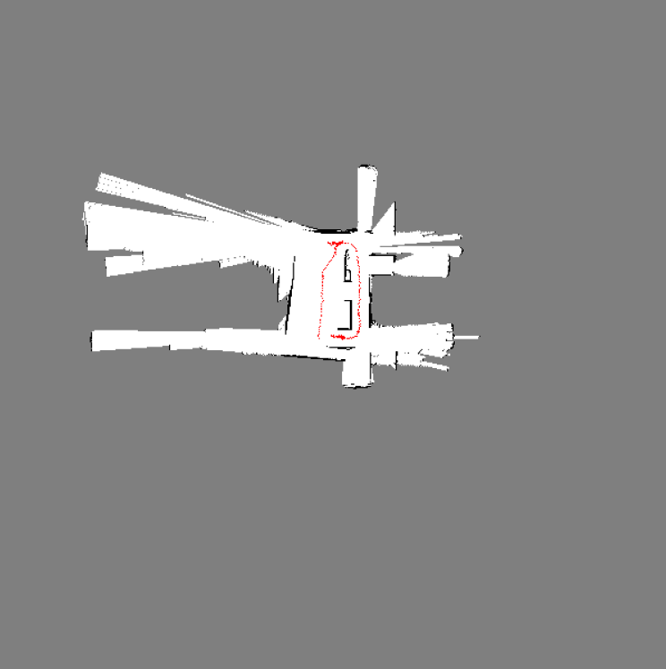

# **SALM (python)**
- - -
## **Introduction**
* ### Implemented a particle filter to track a humanoid robot’s 2D position and orientation using inertial measurement unit (IMU), odometry and laser measurements
* ### Built 2D occupancy grid maps of the environment using the results of the particle filter

## **Results**
* ### map 1

* ### map 2


## **Requirements**
* ### Python 3 
* ### [Training data](https://drive.google.com/open?id=0B241vEW29598Zm5LT241b2xLdWs) (from professor Atanasov 
* ### [Test data](https://drive.google.com/open?id=0B241vEW29598UTJTM2hnMnNfZGs) (from professor Atanasov 

## **Run**
* ### Put the program under ```src```
* ### Put the training data under ```trainset```
* ### Put the testing data under ```testset```
* ### Run the program with ```python main.py```